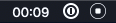

# kap-recording-time 

> [Kap](https://github.com/wulkano/kap) plugin - Show time elapsed while recording

## Demo

## Install

In the `Kap` menu, go to `Preferences…`, select the `Plugins` pane, find this plugin, and toggle it.

## Usage

In the cropper or by right-clicking the tray icon, click the `…` icon, then `Plugins` and make sure `Show recording time` is enabled.
